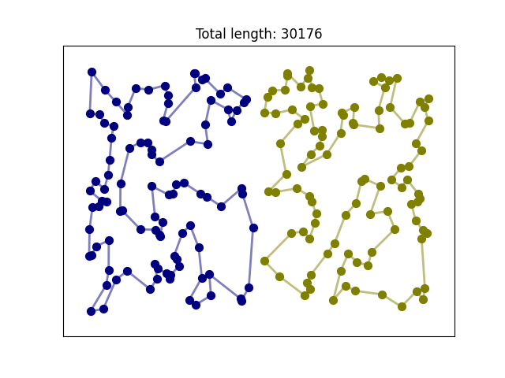
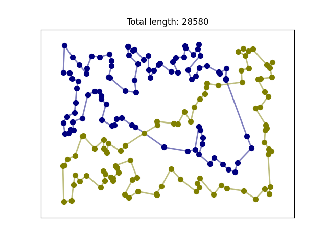
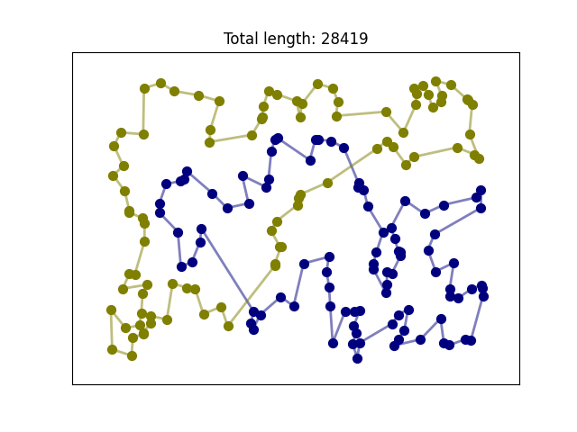
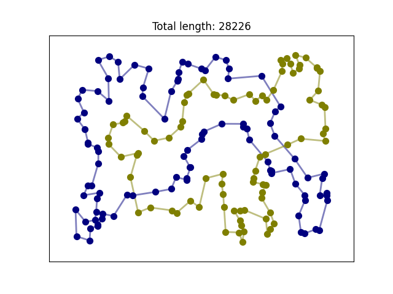

# IMO-TSP

### Modified travelling salesman problem solver. 
The goal is to construct given number of routes that minimize the total distance traveled by all routes.  Routes must consist of equal number of nodes.

### Implemented methods and algorithms

#### Construction heuristics
 - Random constyruction
 - Nearest neighbor
 - Greedy cycle
 - Greedy cycle with regret

#### Local search algorithms
 - Greedy local search
 - Steepest local search
 - Steepest local search with moves chache
 - Iterated local search (with small perturabtions and destroy-rapeair strategy)
 - Large scale neighborhood search
 - Random walk

#### Metaheuristics
 - Candidate moves list
 - Hybrid evolutionary algorithm

## Requirements

 - Visual Studio 2022 (with MSVC 143 and up)
 - CMake 3.15 and up
 - NetworkX python package (https://networkx.org/documentation/stable/index.html#)
 - matplotlib python package (https://matplotlib.org/)

## How to run

 - open project directory in VS22
 - configure methods and data path in `src/main.cpp`
 - run project (with main.exe as a startup item)

It is also possible to use another c++ compiler that supports at least c++20 standard, but it requires some changes in CMake configuration and adjusting relativeProjectRootDir in `src/main.cpp`

## Input data format

Input data is a text file in [TSPLIB](http://comopt.ifi.uni-heidelberg.de/software/TSPLIB95/) format.

By default input data is expected to be in 'data' directory.

## Program output

Program outputs consist of two files:
 - json file with following structure:
	- `num_nodes` - number of nodes in the problem
	- `num_routes` - number constructed routes
	- 'route_length' - number of nodes in each route
	- 'objective_fun' - total length of all routes
	- 'positions' - list of node positions, coords normalized <0,1>; for vizualization purposes
	- 'routes' - list of routes, each route is a list of edges

 - png file with plotted routes

By default results are saved in 'results' directory.

## Example results

